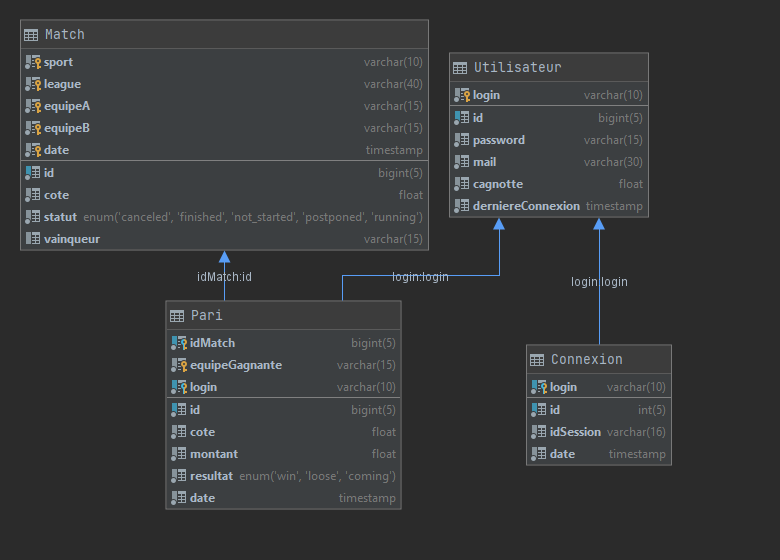

#Dossier Présentation

##Sujet de l'application :
    Notre application a pour but de parier sur des matchs e-sportif se déroulant sur le jeux League of Legends.
    L'utilisateur s'inscrit, il reçoit 500 g-coins(monnaie de l'application) et peut ensuite voir les matchs sur
    il peut parier, ainsi que ces paris en cours et son historique de paris.

##API choisie :
    Nous avons choisi l'API Pandascore qui nous permet de faire 1000 requêtes par heure.
    Cette API nous permet de facilement récupérer les matchs à venir ainsi que le résultat des matchs.
    Grâce à cette API, nous pouvons faire la même chose pour les jeux CS:GO, Dota 2, Overwatch, LOL.
    Même si pour l'instant nous ne faisons cela que pour LOL.
    On pourra donc obtenir les matchs à venir ainsi que les résultats des matchs.

##Fonctionnalités
    Cette application permet la gestion de compte utilisateur, recherche de paris disponibles.
    Ensuite chaque personne peut effectuer un pari sur un match.
    Toutes les heures, les résultats des paris sont mis à jour, et tous les jours on mets à jour les matchs à venir.


##Cas d'utilisation

- Pierre se connecte. Une page d'accueil lui suggère des paris.
  Il en choisit un, les caractéristiques du paris (date, cotes, les équipes, ...)
  Il choisit l'équipe ainsi que la somme de G-Coins à miser.
  Il valide son pari

- Bob se connecte et arrive sur la page d'accueil.
  Il y a une liste lui montrant les matchs sur lesquels il a parié.
  Il clique sur l'un des paris, un écran s'affiche montrant les caractéristiques du paris
  ainsi que le montant parier et l'équipe.

- Alice arrive sur la page de connexion, elle choisit l'option pour s'inscrire.
  Elle rentre son nom, son mail, un mot de passe, un pseudo et clique sur valider.
  Un écran s'affiche lui disant que son compte a été créé.

- Jacques se connecte et arrive sur la page d'accueil.
  Il rentre le nom d'une équipe dans le champ de recherche et les paris disponibles s'affiche.
  Il choisit l'équipe ainsi que la somme de G-Coins à miser.
  Il valide son pari

- Michel se connecte pour la première fois de la journée.
  Un message s'affiche lui disant qu'il a obtenu une récompense quotidienne de G-Coins.
  Il clique sur le bouton et obtient un montant aléatoire de G-coins en plus dans son inventaire.

##Base de donnée :
- Nous utilisons mysql pour stocker nos 4 bases de données :
    - Utilisateur
    - Match
    - Pari
    - Connexion



##Mise à jour des données et appel à l'API externe
###Mise à jour par l'utilisateur
Les données peuvent-être modifiées par l'utilisateur quand il crée un compte, une entrée est créée dans la base de donnée utilisateur.
Ensuite quand l'utilisateur se connecte, une entrée est créée dans la base de donnée de Connexion
L'utilisateur peut aussi effectuer un pari qui sera ajouté à la base de donnée des Pari
###Mise à jour automatique
Toutes les heures, un appel à l'API externe est effectué pour mettre à jour les résultats des matchs venant de se terminer
Ensuite les résultats des paris sont mis à jour.
Tous les jours, un appel est effectué à l'API externe pour connaitre les matchs à venir et les ajouter à la base de donnée des matchs

##Description du serveur
Notre serveur utilise une approche ressources, il est composé de 5 servlets :
- bet : qui permet de gérer les paris
- coins : qui permet de gérer le compte des utilisateurs
- connexion : qui permet de se connecter ou de se déconnecter
- match : qui permet de gérer les matchs, l'ajout, la mise à jour, obtenir la liste des matchs
- user : qui permet de gérer les utilisateurs, créer un utilisateur, supprimer un utilisateur

##Description du Client
Le client est écrit en JavaScript, et est composé d'une seule page avec des listes déroulantes pour avoir accès aux éléments.
L'accueil est composé de 3 listes déroulantes : une pour obtenir la liste des matchs disponibles, une pour voir les paris effectués,
et une pour voir l'historique des paris.
Un appel au serveur est effectué à chaque fois que l'utilisateur interagit avec un bouton.
- Effectuer une recherche : appel au composant match
- Se connecter : appel au composant connexion
- S'inscrire : appel au composant utilisateur
- Effectuer un pari : appel au composant pari

##Descriptions des requêtes
Toutes les requêtes renvoie du JSON de forme :
```json
{
  "code": "valeurRéponse",
  "message": "messageRéponse",
  "result": ["listeRésultats"]
}
```
La valeur de réponse est un code de réponse HTML : 200,400,403.
Le message est une description du résultat de la requête.
Le champ result, il est optionnel s'il n'y a aucun élément nécessaire il n'est pas présent,
c'est l'endroit où se trouve les éléments de résultats, par exemple si l'on effectue
la requête sur la liste des matchs alors le champ résultat sera composé des éléments voulue.
- ###Utilisateur
    - Get id -> obtenir utilisateur
    - POST login mail password -> créer un utilisateur
    - DELETE password idSession login -> supprimer un utilisateur

- ###Connexion
    - POST login motDePasse -> connexion
    - DELETE login -> déconnexion

- ###Pari
    - GET idUtilisateur -> obtenir la liste des paris pour un utilisateur
    - GET idPari -> obtenir le pari
    - POST idMatch idÉquipe montant -> ajouter un pari
    - DELETE idPari -> supprimer un pari

- ###Match
    - GET -> obtenir la liste de tous les matchs
    - GET nomJeux -> obtenir la liste de tous les matchs sur le jeu
    - GET nomLigues -> obtenir la liste de tous les matchs sur la ligue
    - GET nomÉquipe -> obtenir la liste de tous les matchs de l'équipe
    - GET date -> obtenir la liste de tous les matchs se déroulant à la date
    - GET nomJeux nomLigues nomÉquipe date -> Obtenir la liste des paris avec l'équipe sur jeux sur la ligue à la date

- ###G-coins
    - GET idUtilisateur -> obtenir le nombre de G-coins de l'utilisateur
    - POST idUtilisateur -> obtenir récompense quotidienne


##Schéma du Système
Notre application est écrite en Go pour la partie serveur et en JavaScript pour le client.
Elle est composée de 5 servlets pour gérer les différents aspects de l'application.
La base de données est hébergée chez AWS de même que le serveur,
il est accessible à cette adresse : [G - bet](http://projet-pc3r.eba-d6ekfsap.eu-west-3.elasticbeanstalk.com/)

#Manuel
##Installation
Pour installer l'application, il faut commencer par cloner le répertoire :
````shell
git clone https://gitlab.com/CTeillet/pc3r-projet
````
Il faut ensuite lancer l'application :
````shell
cd pc3r-projet/src
go run application.go
````

#Développement de l'application
##Points forts
  - ###Déploiement direct
L'un des points forts de notre application est son déploiement direct.
À chaque commit l'application est automatiquement déployé sur AWS. 
Notre application est donc utilisable par tous directement sans installation.
  - ###Pas beaucoup de solution similaire
Il n'existe que très peu de sites offrant la possibilité de parier sur des matchs e-sportif.
Cette application est donc une solution intéressante pour des gens s'intéressant à des compétitions e-sportif comme 
League of Legends, CS:GO, Dota 2 ou Overwatch.
Actuellement, nous avons implémenté seulement pour League Of Legends mais il ne faudrait pas beaucoup de travail pour ajouter les autres compétitions

##Choix de design
Notre application est très accessible puisque après être inscrit, 
il est très facile de pouvoir parier, il suffit soit de rechercher un match avec la barre de recherche puis de parier sur une équipe, 
soit de mettre un pari sur un des matchs disponibles. Design minimaliste

##Choix d'implémentation
Nous avons choisi d'implémenter notre serveur en Go, puisque nous voulions voir la différence avec le développement de serveur en JAVA.
Notre client est développé en JavaScript sans bibliothèque externe.

##Conclusion
- ###Possibles améliorations
  - Pour améliorer notre application, il faudrait ajouter le support des compétitions d'autres jeux.
  - Nous pourrions aussi modifier la recherche pour ne pas avoir à rechercher des mots complets mais juste des morceaux de mots 
  - Nous pourrions aussi modifier la recherche pour proposer des matchs qui peuvent intéresser l'utilisateur 
    en fonction de ces précédents paris.
  - Nous pourrions utiliser un Cookie pour maintenir la connexion de l'utilisateur